Agro Scout

The app was created as a quick fix to collect agricultural data from the highland of Peru for the Peruvian Agriculturas Catastrophic Insurance Program, 
due to time restrictions it was made in a month and not following the Google Guidelines. It is being refactored.

App Modules:
-Login
-Regional Map Selector (With popup information widget)
-Detail of insured crop in Statistical Sector
-Outlined overlay of Statistical Sector
-Tool for deliniation of boundaries of cultivated area.
-Itent for sendig data through message app, mail or json to backend.

Graficos ....
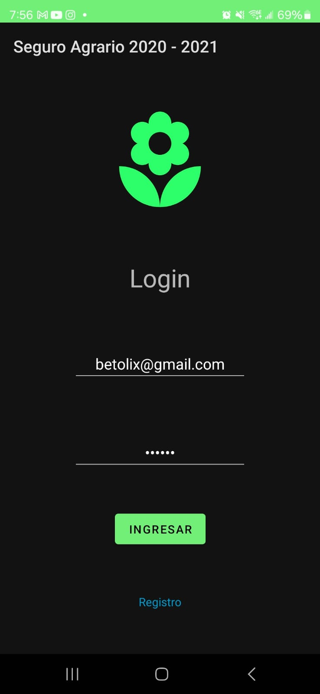
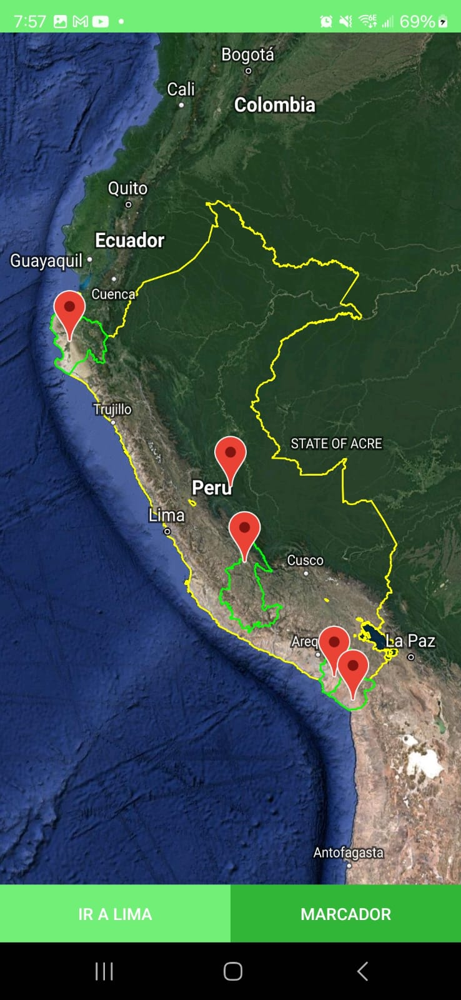7
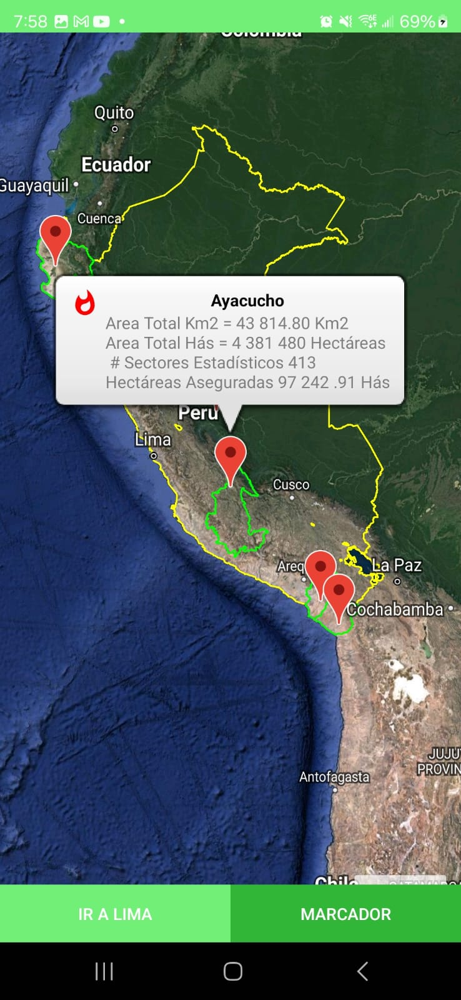
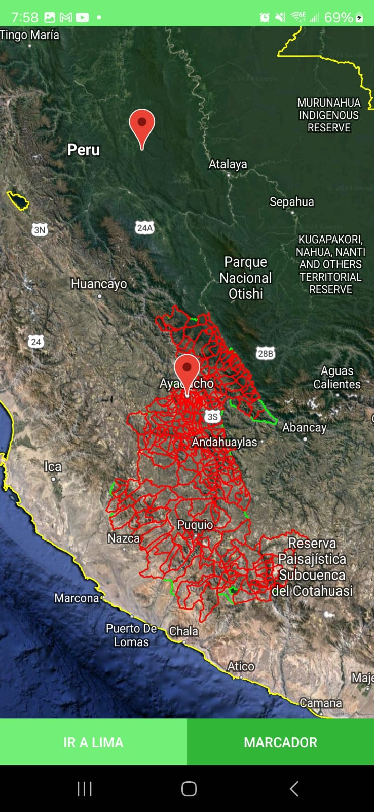
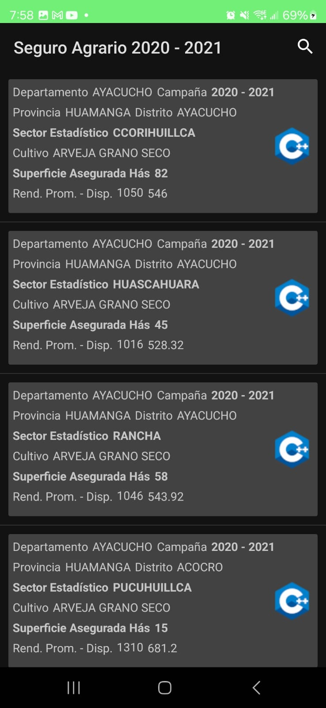
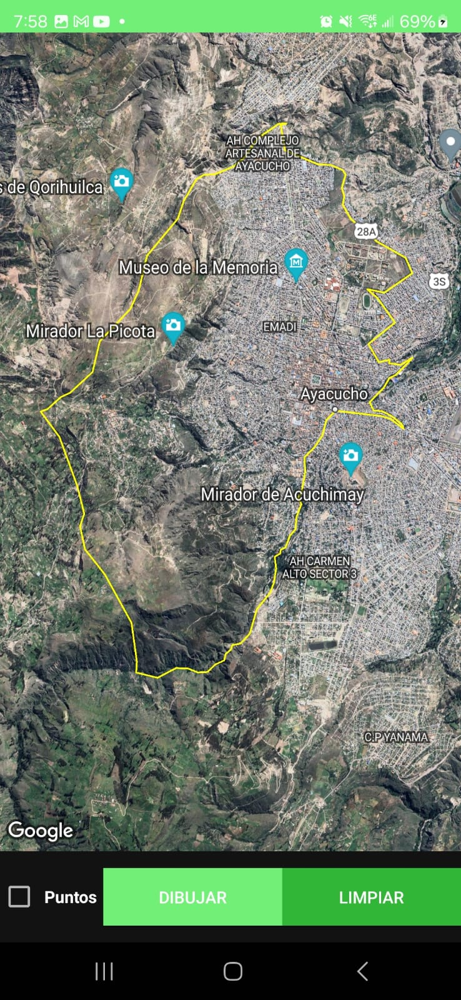
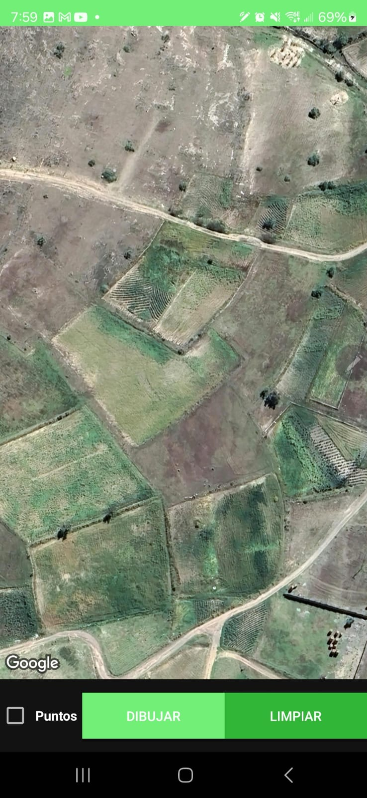
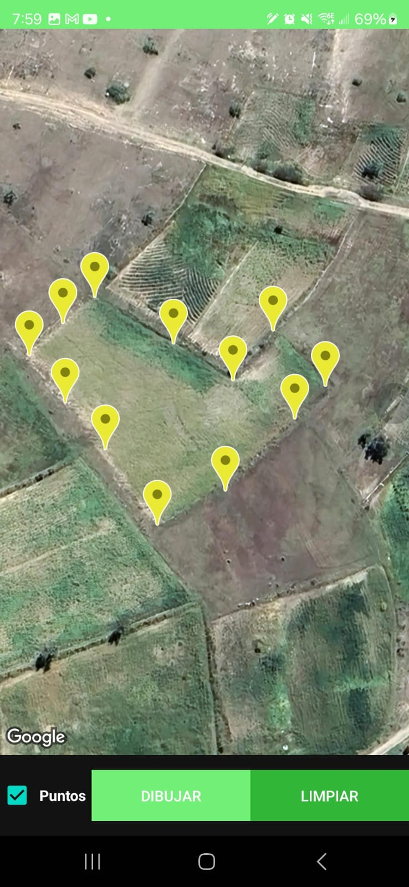
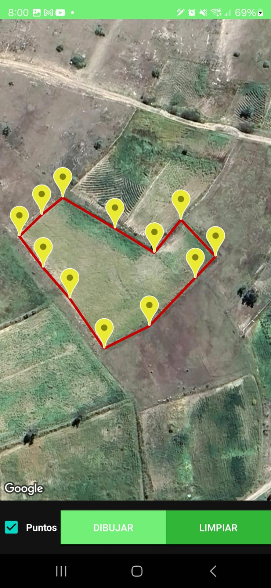
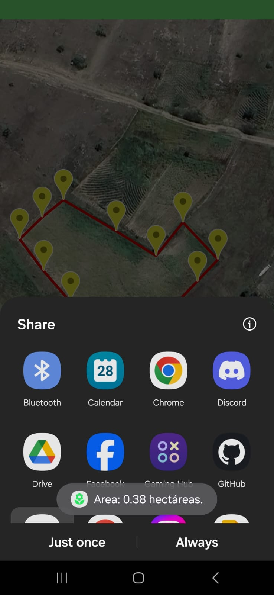
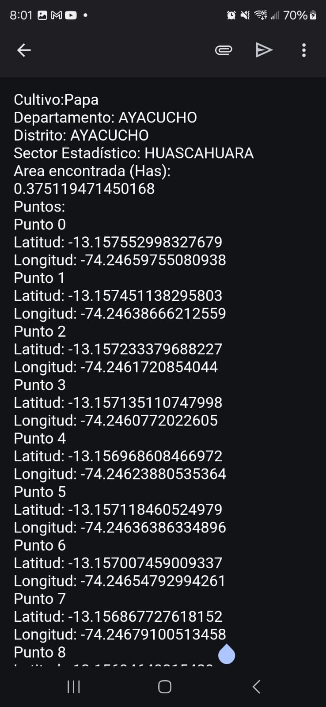
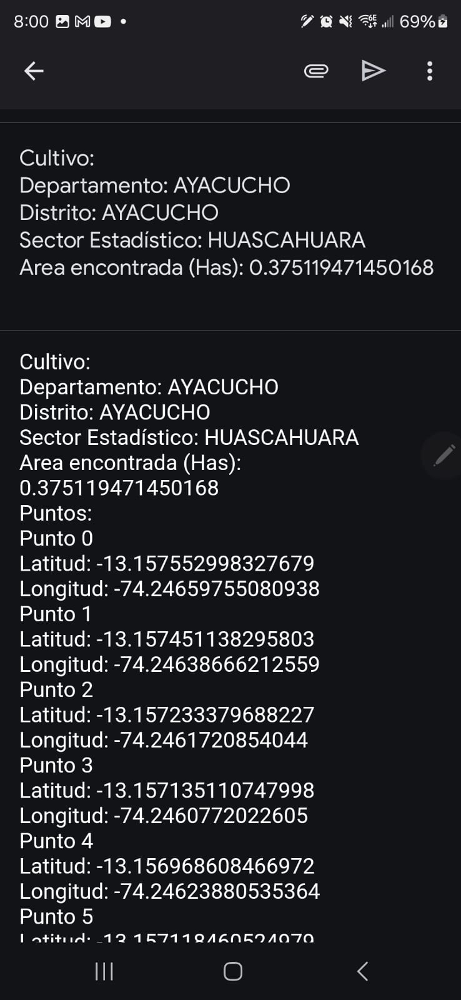
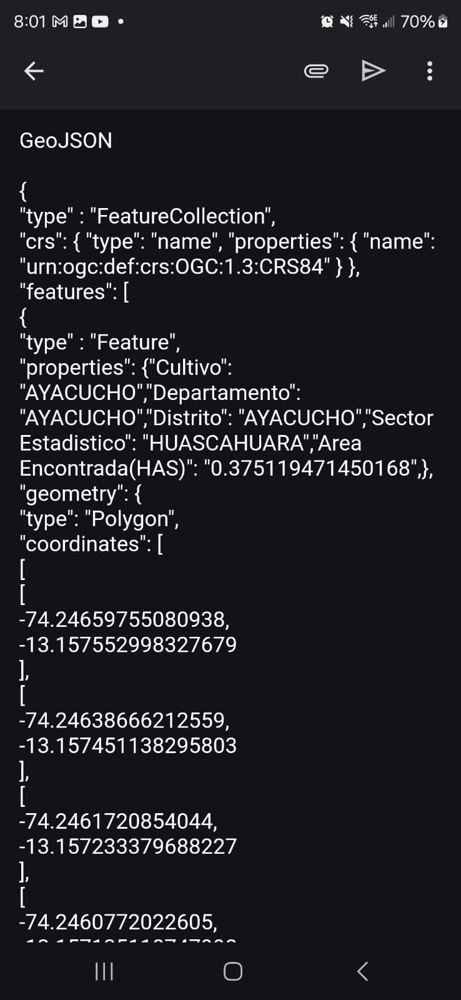

Backed Module:

To setup the backend in a local machine:

Database:
Postgres databases are 
The id_db handles authentication. 
The role_db handles authorization.

To make the backend run:
1 - Spin up a postgres instance.
2 - Create the user "node_user" with the password "node_password" with the corresponding privileges.
3 - Restore the databases from the database folder.
4 - On the "backend-server" folder with a command line

$ npm install
$ npm run

Make sure that on the Android Project on the file app/java/scoutagro/api/WebServiceJWT.java

The line private static final String BASE_URL_JWT = "http://10.0.0.251:3000";

Points to your local computer ip address
